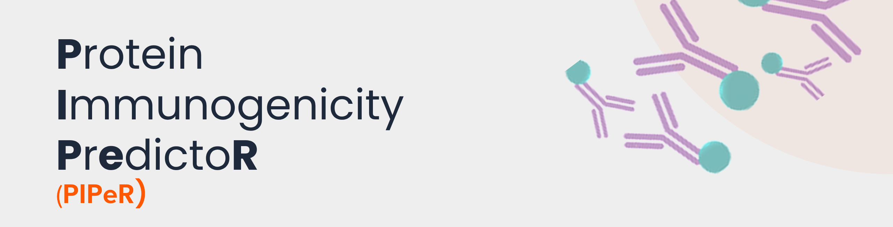
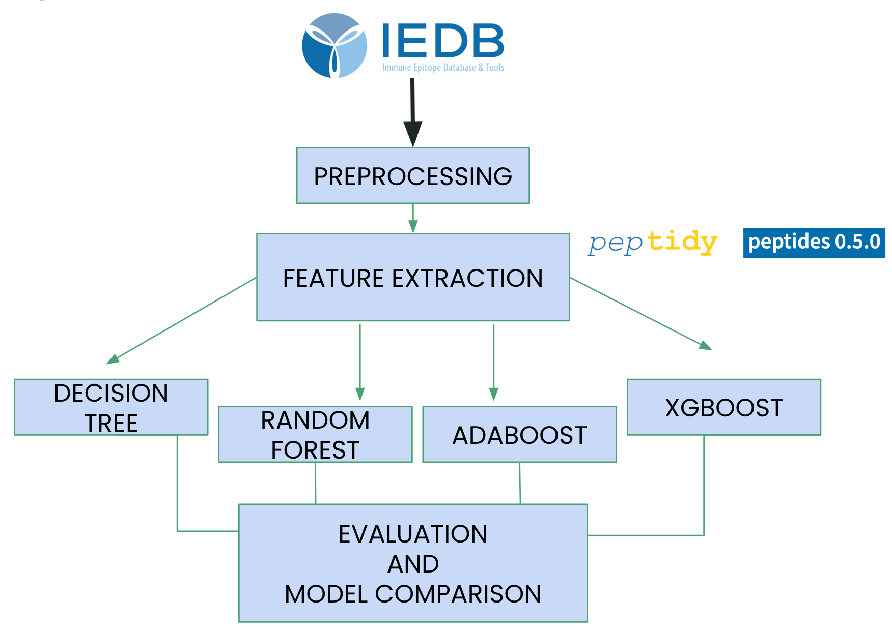

<p align="center">
  
</p>

# PIPER  
**Protein Immunogenicity PredictoR**


---

## Overview

PIPER is a machine learning tool for predicting the immunogenicity of peptide–HLA complexes.  
Given a peptide sequence and its corresponding HLA allele, the model classifies the pair as immunogenic or non-immunogenic.

The approach combines position-specific peptide features, global HLA pseudosequence features, and an ensemble of trained models to produce a consensus prediction.

This project was developed as part of the course  
**02-206 Machine Learning for Scientists, Spring 2026**.

<p align="center">
  
</p>
---

## Structure

```
PIPER/
├── data/
│   ├── raw/                                      # raw datasets
│   ├── features/                                 # processed feature datasets
│   ├── splits/                                   # train/val/test splits
│   ├── dataset_train.csv
│   ├── dataset_val.csv
│   ├── dataset_test.csv
│   ├── processed_sars_cov_2_with_global_features.csv
│   ├── processed_sars_cov_2_with_position_specific_features.csv
│   ├── deprecated/
│   └── README.md
│
├── models/
│   └── best_models/                              # models used in PIPER
│
├── results/                                      # saved prediction outputs
│   └── piper_predictions_*.csv
│
├── src/                                          # scripts and utilities
│
├── figures/                                      # evaluation plots and figures
│
├── example.csv                                   # sample input file
├── requirements.txt                              # project dependencies
├── main.py                                       # CLI entry point
└── README.md
```

## Installation

Clone the repository and install dependencies:

```bash
git clone https://github.com/nikitarjsh/PIPER.git
cd PIPER
pip install -r requirements.txt
```

Requires Python 3.10 or later

## Usage

### Single p-HLA prediction

```bash
python main.py --peptide NVFAFPFTIY --hla HLA-B*15:01
```

### p-HLA input file

```bash
python main.py --input_csv example.csv
```

The input CSV should contain two columns:

```csv
peptide,HLA
```

## Output

PIPER saves prediction results as a CSV file in the `results/` directory.

Each row corresponds to a peptide–HLA pair and includes:
- The input (`peptide`, `HLA`)
- Predicted probability from each model
- Predicted class from each model
- Final consensus probability (soft voting)
- Final consensus prediction

### Example

| peptide     | HLA            | adaboost_prob | xgboost_prob | rf_prob | lightgbm_prob | consensus_prob | prediction   |
|-------------|----------------|---------------|--------------|---------|---------------|----------------|-------------|
| NVFAFPFTIY  | HLA-B*15:01    | 0.61          | 0.97         | 0.90    | 1.00          | 0.87           | immunogenic |

## Contact

Hamda Alhosani  
Noemi Banda  
Nikita Rajesh  
Beth Vazquez Smith  

halhosan@andrew.cmu.edu  
bvazquez@andrew.cmu.edu  
nrajesh@andrew.cmu.edu  
noemib@andrew.cmu.edu  


---

**Last Updated:** 2026  
**Version:** 1.0